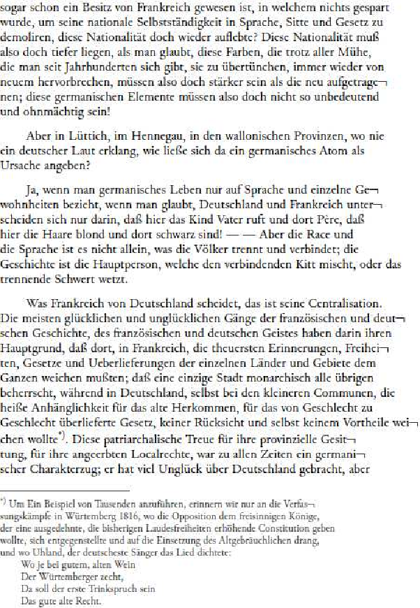
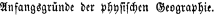
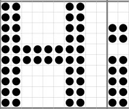
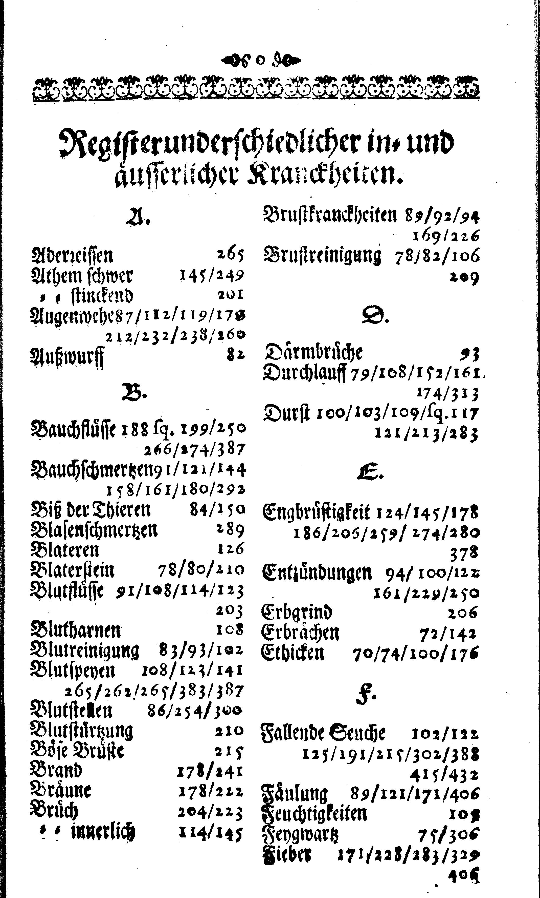
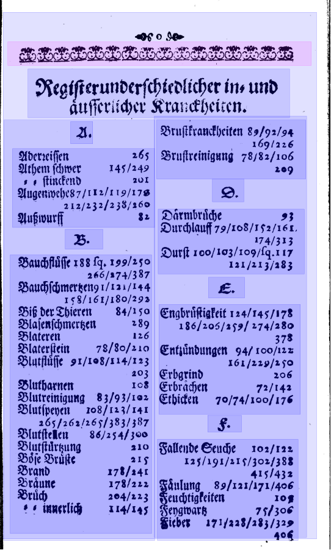
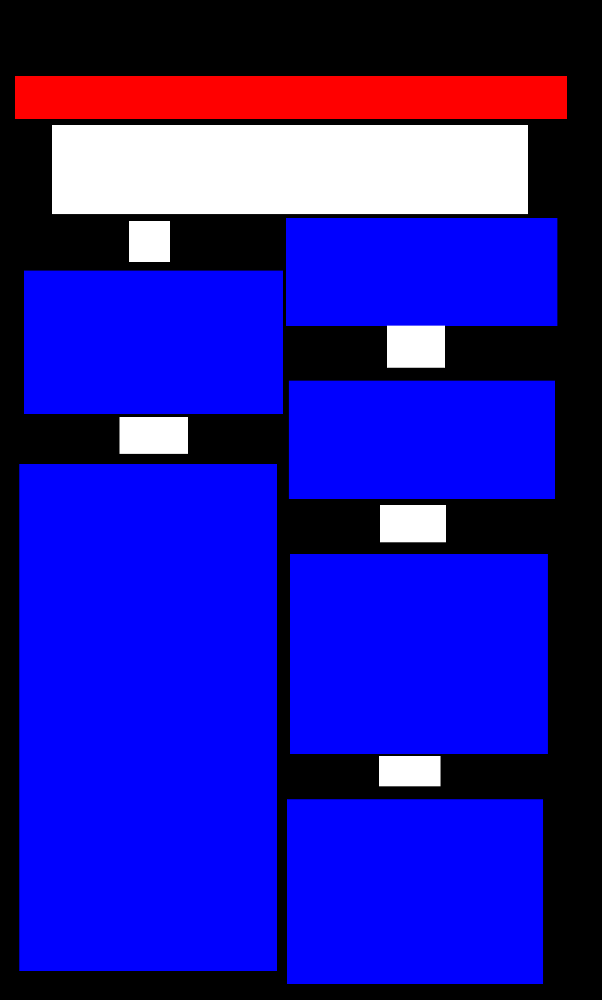
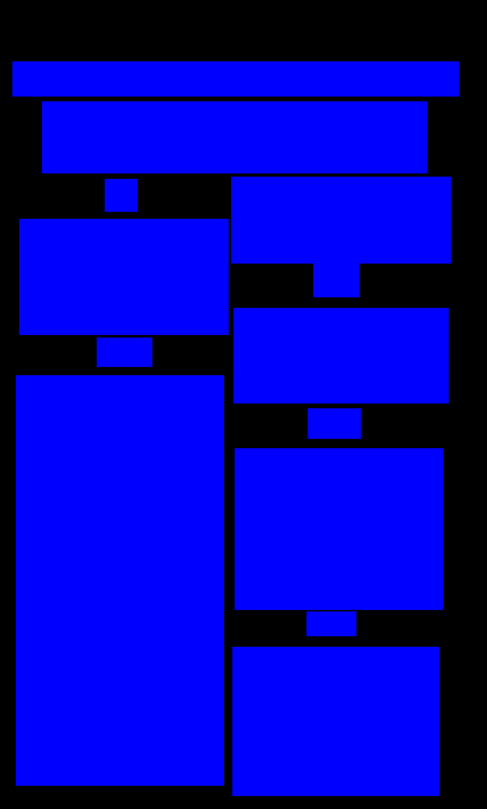

layout: true
  
<div class="my-header"></div>

<div class="my-footer">
  <table>
    <tr>
      <td style="text-align:right">Sächsische Landesbibliothek – Staats- und Universitätsbibliothek</td>
      <td>Date</td>
      <td style="text-align:right"><a href="https://www.slub-dresden.de/">www.slub-dresden.de</a></td>
    </tr>
    <tr>
      <td style="text-align:right">Referat 4.3</td>
      <td />
    </tr>
  </table>
</div>

<div class="my-title-footer">
  <table>
    <tr>
      <td style="text-align:left"><b>Kay-Michael Würzner</b></td>
    </tr>
    <tr>
      <td style="text-align:left">Referat 4.3</td>
    </tr>
    <tr>
      <td style="font-size:8pt"><b>8. Mai 2026</b></td>
    </tr>
    <tr>
      <td style="font-size:8pt">Datenkompetenzseminar</td>
    </tr>
  </table>
</div>

---

class: title-slide
count: false

# Optical Character Recognition
## (auch) mit generativer KI

---

# Overview

- Kurze Einführung OCR

---

class: part-slide
count: false

# Kurze Einführung OCR

.cols[
.sixty[
- Bilderfassung ≠ Texterfassung
- **O**ptical **C**haracter **R**ecognition: Automatische Erfassung von Text in Bildern
- ursprünglich begrenzt auf Zeichenerkennung
- heute häufig Synonym für den gesamten Texterfassungsprozess
  + Bildvorverarbeitung
  + Layoutanalyse (OLR)
  + Zeilenerkennung
  + ...
]
.fourty[
<center></center>
]
]

---

# Komponenten eines einfachen OCR-Workflows

.cols[
.fifty[
]
.fourty[
<p style="margin-top:-80px">

</p>
]
]

---

count: false

# Komponenten eines einfachen OCR-Workflows

.cols[
.fifty[
- Bildvorverarbeitung
]
.fourty[
<p style="margin-top:-80px">

</p>
]
]

---

count: false

# Komponenten eines einfachen OCR-Workflows

.cols[
.fifty[
- Bildvorverarbeitung
]
.fourty[
<p style="margin-top:-80px">

</p>
]
]

---

count: false

# Komponenten eines einfachen OCR-Workflows

.cols[
.fifty[
- Bildvorverarbeitung
- Layoutanalyse
]
.fourty[
<p style="margin-top:-80px">

</p>
]
]

---

count: false

# Komponenten eines einfachen OCR-Workflows

.cols[
.fifty[
- Bildvorverarbeitung
- Layoutanalyse
]
.fourty[
<p style="margin-top:-80px">

</p>
]
]

---

count: false

# Komponenten eines einfachen OCR-Workflows

.cols[
.fifty[
- Bildvorverarbeitung
- Layoutanalyse
    * **strukturierende** Elemente
        + Absätze
        + Überschriften
]
.fourty[
<p style="margin-top:-80px">

</p>
]
]

---

count: false

# Komponenten eines einfachen OCR-Workflows

.cols[
.fifty[
- Bildvorverarbeitung
- Layoutanalyse
    * **strukturierende** Elemente
        + Absätze
        + Überschriften
    * **textflussunterbrechende** Elemente
        + Seitenzahlen
        + Kolumnentitel
        + Abbildungsunterschriften
        + Marginalien etc.
]
.fourty[
<p style="margin-top:-80px">

</p>
]
]

---

count: false

# Komponenten eines einfachen OCR-Workflows

.cols[
.fifty[
- Bildvorverarbeitung
- Layoutanalyse
    * **strukturierende** Elemente
        + Absätze
        + Überschriften
    * **textflussunterbrechende** Elemente
        + Seitenzahlen
        + Kolumnentitel
        + Abbildungsunterschriften
        + Marginalien etc.
    * **nichttextuelle** Elemente
        + Abbildungen
        + Tabellen etc.
]
.fourty[
<p style="margin-top:-80px">

</p>
]
]

---

count: false

# Komponenten eines einfachen OCR-Workflows

.cols[
.fifty[
- Bildvorverarbeitung
- Layoutanalyse
    * **strukturierende** Elemente
        + Absätze
        + Überschriften
    * **textflussunterbrechende** Elemente
        + Seitenzahlen
        + Kolumnentitel
        + Abbildungsunterschriften
        + Marginalien etc.
    * **nichttextuelle** Elemente
        + Abbildungen
        + Tabellen etc.
- Texterkennung
]
.fourty[
<p style="margin-top:-80px">

</p>
]
]

---

# Texterkennung: Technik

- Erkennung erfolgt *zeilenweise*
  1. **Skalierung:** einheitliche Höhe für alle Zeilen
  2. **Merkmalsextraktion**: Raster mit festgelegter Anzahl (horizontaler) Zeilen und variabler Anzahl (vertikaler) Spalten → Zeilen als Sequenzen binärwertiger Vektoren fixer Länge
<center></center>
- kontextsensitive Erkennung über *Übergangswahrscheinlichkeiten* der Vektoren
- Zerlegung der Seite in *Zeilen* notwendig
- Vorgehen robuster gegenüber Varianz durch Artefakte als zeichenorientierte Ansätze
- `Tesseract` (ab Version 4), `OCRopus`, `kraken`, `Calamari`
  + Einsatz *neuronaler Netze* für die Sequenzklassifikation

---

# Texterkennung: Technik

- Sequenzklassfikation
    + Daten
        * https://htr-united.github.io/
        * manuell transkribierte Textzeilen
    + Kodierung `\(f: \mathbb{N}^{10}\rightarrow\mathbb{B}\)` 
      $$
      f(x[n]) = \begin{cases} 1 & \text{Pixel in Zelle $(x,n)$ schwarz} \\\\
      0 & \, \text{sonst}\end{cases}
      $$ 
    + Training
        * Zählen von Sequenzen aus Vektor-Buchstabenteil-Paaren
        * Repräsentation als OCR-Modell
        * Tesseract: [tesstrain](https://github.com/tesseract-ocr/tesstrain)
.cols[
.fifty[
```
  0123456789
0 1111111111
2 0000110000 
```
]
.fifty[
<center>

</center>
]
]

---

# *Layoutanalyse* per Pixelklassifizierung

.cols[
.fifty[
]
.fourty[
<p style="margin-top:-30px">

</p>
]
]

---

count: false

# *Layoutanalyse* per Pixelklassifizierung

.cols[
.fifty[
- Training auf manuell strukturierten Seiten
- jedes Pixel gehört in ein Segment
- jedes Pixel gehört zu einer Klasse
]
.fourty[
<p style="margin-top:-30px">

</p>
]
]

---

count: false

# *Layoutanalyse* per Pixelklassifizierung

.cols[
.fifty[
- Training auf manuell strukturierten Seiten
- jedes Pixel gehört in ein Segment
- jedes Pixel gehört zu einer Klasse
]
.fourty[
<p style="margin-top:-30px">

</p>
]
]

---

count: false

# *Layoutanalyse* per Pixelklassifizierung

.cols[
.fifty[
- Training auf manuell strukturierten Seiten
- jedes Pixel gehört in ein Segment
- jedes Pixel gehört zu einer Klasse
    + Illustration durch Farbe pro Segmenttyp
]
.fourty[
<p style="margin-top:-30px">

</p>
]
]

---

count: false

# *Layoutanalyse* per Pixelklassifizierung

.cols[
.fifty[
- Training auf manuell strukturierten Seiten
- jedes Pixel gehört in ein Segment
- jedes Pixel gehört zu einer Klasse
    + Illustration durch Farbe pro Segmenttyp
]
.fourty[
<p style="margin-top:-30px">

</p>
]
]

---

count: false

# *Layoutanalyse* per Pixelklassifizierung

.cols[
.fifty[
- Training auf manuell strukturierten Seiten
- jedes Pixel gehört in ein Segment
- jedes Pixel gehört zu einer Klasse
    + Illustration durch Farbe pro Segmenttyp
- Klassifikation der Pixel anhand ihrer **Umgebung** (i.e. Farbe im Original)
]
.fourty[
<p style="margin-top:-30px">

</p>
]
]

---

count: false

# *Layoutanalyse* per Pixelklassifizierung

.cols[
.fifty[
- Training auf manuell strukturierten Seiten
- jedes Pixel gehört in ein Segment
- jedes Pixel gehört zu einer Klasse
    + Illustration durch Farbe pro Segmenttyp
- Klassifikation der Pixel anhand ihrer Umgebung (i.e. Farbe im Original)
    + beliebig komplexe Schemata möglich
        * Text vs. Nichttext
]
.fourty[
<p style="margin-top:-30px">

</p>
]
]

---

count: false

# *Layoutanalyse* per Pixelklassifizierung

.cols[
.fifty[
- Training auf manuell strukturierten Seiten
- jedes Pixel gehört in ein Segment
- jedes Pixel gehört zu einer Klasse
  + Illustration durch Farbe pro Segmenttyp
- Klassifikation der Pixel anhand ihrer Umgebung (i.e. Farbe im Original)
  + beliebig komplexe Schemata möglich
      * Text vs. Nichttext
]
.fourty[
<p style="margin-top:-30px">

</p>
]
]

---

class: part-slide

# Many thanks for your attention!

<center>
<a href="https://wrznr.github.io/slide-template/">wrznr.github.io/slide-template</a>
</center>
